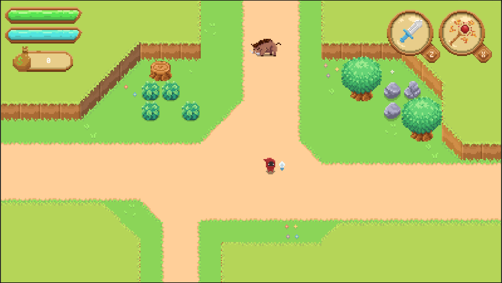
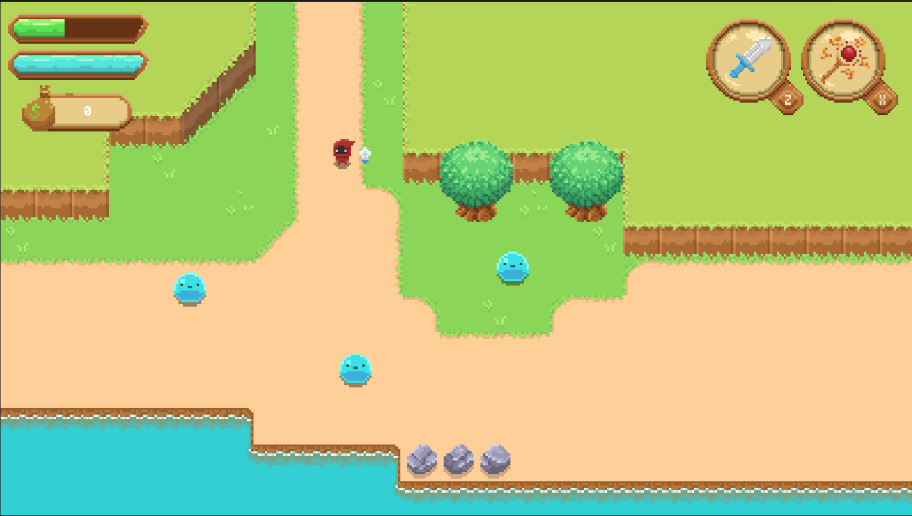
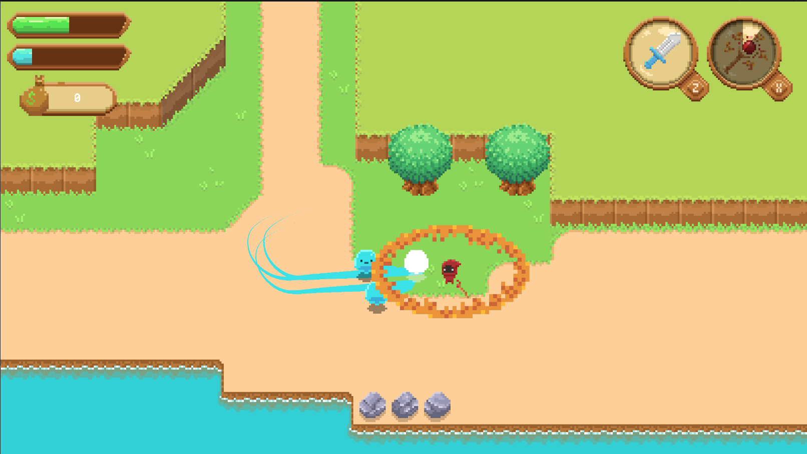
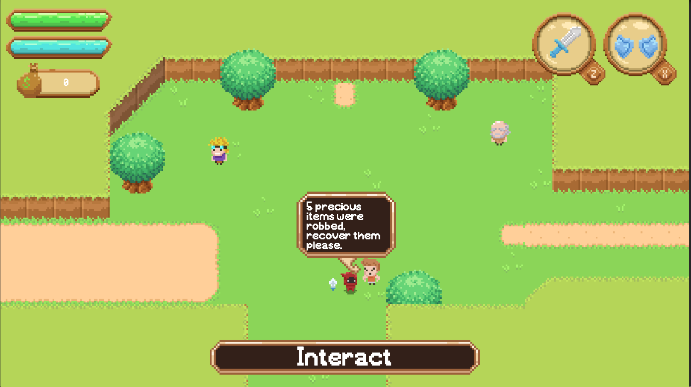
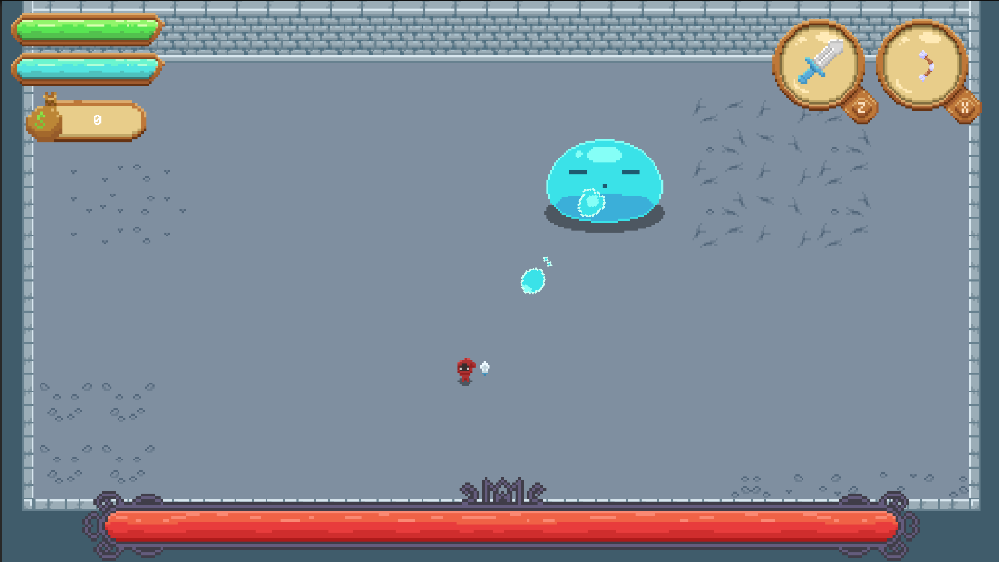

Zelda Like
This is a top-dow 2D pixel art adventure game done in Unity. Some of the systems implemented for this game were:
- Saving
- Menu Navigation
- Cinematics 
- Combat
- Movement
- Enemies AI
- Enemies Vision
- Droppables
- Interactables
- Quests
- Dialogue
- Rooms Management

All assests of this prototype were provided by Phracassado of the Deep, a dear friend of mine.

